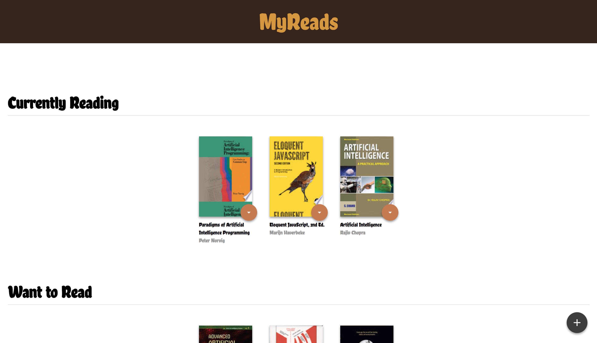

# MyReads Project

## Goal
Creating myreads for the Front-End Web Developer Nanodegree Program in Google Developer Challenge Scholarship 2017/2018.

## To load project locally
* You have to „Clone or download” this project.
* install all project dependencies with `npm install`
* start the development server with `npm start`

## Contributing
First commit is the starter code from [Udacity](https://github.com/udacity/reactnd-project-myreads-starter).

## Page appearance 
Homepage

Search

